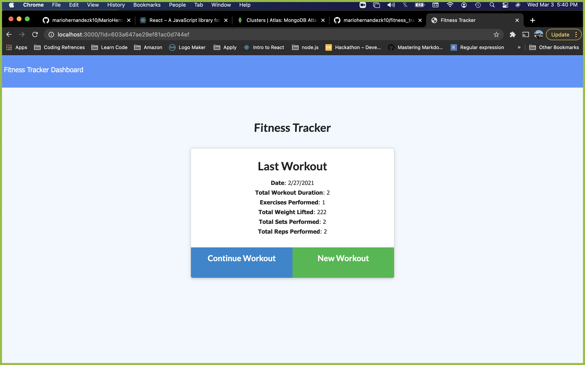

# Fitness Tracker
Mario Hernandez

## Table of Contents

* User Story
* Technologies
* Screenshot
* Usage
* License

# User Story: 

As a user, I want to be able to view create and track daily workouts. I want to be able to log multiple exercises in a workout on a given day. I should also be able to track the name, type, weight, sets, reps, and duration of exercise. If the exercise is a cardio exercise, I should be able to track my distance traveled.

Deploy Here: 

# Technologies:

HTML, CSS, JS, express, mongoosedb

## Screenshot

  

## License

© 2020 Copyright
